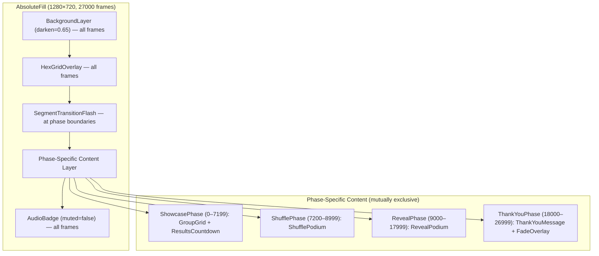

# Design Document: Closing Ceremony V2

## Overview

This design covers the complete redesign of `03-GameDayStreamClosing-Audio.tsx`, a Remotion composition (1280×720, 30fps, 27000 frames / 15 minutes). The current implementation suffers from broken circular logo crops, overlapping timers, confusing numbered columns, and a cluttered dashboard feel. The redesign replaces it with a four-phase cinematic flow.

The four phases are:

1. **Showcase Phase** (frames 0–7199, 4 min): Paginated 3×2 grid celebrating all 53 user groups with landscape logos, flags, and city names — adapted from the `GroupsScrollSceneV4` pattern
2. **Shuffle Phase** (frames 7200–8999, 1 min): Animated podium with 6 positions cycling random groups and fictitious scores, building suspense before the reveal
3. **Reveal Phase** (frames 9000–17999, 5 min): Sequential winner reveal from 6th to 1st place with dramatic spring animations, score count-ups, and growing podium bars, culminating in a full podium display
4. **ThankYou Phase** (frames 18000–26999, 5 min): Thank-you message with fade-to-dark in the final 90 frames

Key design decisions:
- **Reuse archive data**: Import `USER_GROUPS` and `LOGO_MAP` from `archive/CommunityGamedayEuropeV4.tsx` (requires adding `export` to `USER_GROUPS`)
- **Landscape logos only**: All logos rendered at 600:337 aspect ratio with `objectFit: "contain"` — no circular crops anywhere
- **Frame-driven state**: All visibility and animation derived from `useCurrentFrame()`, no React state
- **Single-file composition**: All sub-components live in `03-GameDayStreamClosing-Audio.tsx`
- **Shared design system**: Reuse `BackgroundLayer`, `HexGridOverlay`, `AudioBadge`, `GlassCard`, `springConfig`, `formatTime` from `shared/GameDayDesignSystem.tsx`

## Architecture

The composition uses a layered architecture within a single `AbsoluteFill` container. Phase-specific content is conditionally rendered based on the current frame number. Persistent layers (background, hex grid, audio badge) render across all 27000 frames.



### Phase Timeline

```mermaid
gantt
    title Composition Phases (27000 frames / 15 min)
    dateFormat X
    axisFormat %s

    section Showcase (0–7199)
    User Group Grid Pages       :0, 7200
    Results Countdown           :0, 7200

    section Shuffle (7200–8999)
    Podium Shuffle Animation    :7200, 9000

    section Reveal (9000–17999)
    6th Place Reveal            :9000, 9600
    5th Place Reveal            :9600, 10200
    4th Place Reveal            :10200, 10800
    3rd Place Reveal            :10800, 11700
    2nd Place Reveal            :11700, 12600
    1st Place Reveal            :12600, 13500
    Full Podium Display         :13500, 18000

    section ThankYou (18000–26999)
    Thank You Message           :18000, 26910
    Fade to Dark                :26910, 27000
```



### Key Architectural Decisions

1. **Single-file composition**: All sub-components (`ShowcasePhase`, `ShufflePhase`, `RevealPodium`, `ThankYouPhase`, `GroupCard`, `PodiumBar`, `TeamRevealCard`, `ResultsCountdown`, `SegmentTransitionFlash`) live in `03-GameDayStreamClosing-Audio.tsx`. This matches the project pattern and keeps the composition self-contained.

2. **Frame-driven rendering**: All visibility, positioning, and animation are pure functions of `useCurrentFrame()`. No `useState` or `useEffect`. This is consistent with Remotion best practices and makes the composition deterministic and testable.

3. **Phase gating via helper function**: A `getActivePhase(frame)` pure function returns the current phase enum. Each phase component receives the frame and only renders when active. This makes phase correctness testable independently of React rendering.

4. **Data imports from archive**: `USER_GROUPS` needs `export` added in the archive file. `LOGO_MAP` is already exported. `PODIUM_TEAMS` remains defined locally in the closing ceremony file since it's specific to this composition.

5. **Spring animations from design system**: All animations use `springConfig.entry`, `springConfig.emphasis` from `GameDayDesignSystem.tsx`. The shuffle phase uses custom interpolation for the decelerating cycle speed.


## Components and Interfaces

### Pure Utility Functions (Exported for Testing)

```typescript
// Phase enum for type-safe phase gating
export enum Phase {
  Showcase = "showcase",
  Shuffle = "shuffle",
  Reveal = "reveal",
  ThankYou = "thankyou",
}

// Phase boundary constants
export const PHASE_BOUNDARIES = {
  showcaseStart: 0,
  showcaseEnd: 7199,
  shuffleStart: 7200,
  shuffleEnd: 8999,
  revealStart: 9000,
  revealEnd: 17999,
  thankYouStart: 18000,
  thankYouEnd: 26999,
} as const;

// Reveal frame offsets for each placement
export const REVEAL_FRAMES = {
  6: 9000,
  5: 9600,
  4: 10200,
  3: 10800,
  2: 11700,
  1: 12600,
  fullPodium: 13500,
} as const;

// Pure function: returns the active phase for any frame
export function getActivePhase(frame: number): Phase {
  if (frame <= 7199) return Phase.Showcase;
  if (frame <= 8999) return Phase.Shuffle;
  if (frame <= 17999) return Phase.Reveal;
  return Phase.ThankYou;
}

// Pure function: returns whether a phase boundary flash should show
export function isTransitionFrame(frame: number): boolean {
  const boundaries = [0, 7200, 9000, 18000];
  return boundaries.some(b => frame >= b && frame < b + 60);
}

// Pure function: returns the page index for the showcase grid
export function getShowcasePage(frame: number, groupCount: number): number {
  const GROUPS_PER_PAGE = 6;
  const PAGE_DURATION = 120; // 4 seconds per page
  const totalPages = Math.ceil(groupCount / GROUPS_PER_PAGE);
  const page = Math.floor(frame / PAGE_DURATION);
  return Math.min(page, totalPages - 1);
}

// Pure function: returns all pages that will be shown during showcase
export function getAllShowcasePages(groupCount: number): number {
  return Math.ceil(groupCount / 6);
}

// Pure function: returns the shuffle cycle speed (frames per cycle) at a given frame
export function getShuffleCycleSpeed(frameInPhase: number): number {
  // Start fast (10 frames/cycle), decelerate to 60 frames/cycle
  const progress = frameInPhase / 1800; // 1800 frames in shuffle phase
  return Math.round(10 + progress * 50);
}

// Pure function: returns which placements are revealed at a given frame
export function getRevealedPlacements(frame: number): number[] {
  const placements: number[] = [];
  if (frame >= 9000) placements.push(6);
  if (frame >= 9600) placements.push(5);
  if (frame >= 10200) placements.push(4);
  if (frame >= 10800) placements.push(3);
  if (frame >= 11700) placements.push(2);
  if (frame >= 12600) placements.push(1);
  return placements;
}

// Pure function: returns the score count-up value
export function getCountUpValue(targetScore: number, frame: number, revealFrame: number): number {
  const elapsed = Math.max(0, frame - revealFrame);
  const progress = Math.min(1, elapsed / 60);
  const eased = 1 - Math.pow(1 - progress, 3);
  return Math.round(eased * targetScore);
}

// Pure function: returns fade opacity for the final frames
export function getFadeOpacity(frame: number): number {
  if (frame < 26910) return 0;
  return Math.min(1, (frame - 26910) / 90);
}
```

### React Components

#### GameDayClosing (Root Composition)
The main exported component. Uses `useCurrentFrame()` and `useVideoConfig()`. Renders persistent layers and conditionally renders the active phase component.

```
GameDayClosing
├── BackgroundLayer (darken=0.65)
├── HexGridOverlay
├── SegmentTransitionFlash (at phase boundaries)
├── {phase === Showcase && <ShowcasePhase />}
├── {phase === Shuffle && <ShufflePhase />}
├── {phase === Reveal && <RevealPhase />}
├── {phase === ThankYou && <ThankYouPhase />}
└── AudioBadge (muted=false)
```

#### SegmentTransitionFlash
Brief gold/violet gradient overlay at phase boundaries (frames 0, 7200, 9000, 18000). Lasts ~60 frames with opacity fade-in/fade-out. Uses `interpolate` for opacity.

#### ShowcasePhase (frames 0–7199)
Renders the paginated 3×2 grid of user group cards plus the `ResultsCountdown`.

- Imports `USER_GROUPS` and `LOGO_MAP` from archive
- Calculates current page from frame: `Math.floor(frame / PAGE_DURATION)`
- Slices `USER_GROUPS` for current page (6 per page)
- Renders 6 `GroupCard` components with staggered spring entry
- Page transitions use spring-based opacity/translate animations
- Includes a thin progress bar at top (like `GroupsScrollSceneV4`)

#### GroupCard
Individual user group card within the showcase grid. Renders inside a `GlassCard`:
- Logo container at 600:337 aspect ratio with `objectFit: "contain"`
- Falls back to large flag emoji on gradient background if no LOGO_MAP entry
- Flag emoji, group name, and city name below the logo
- Spring-based entry animation with staggered delay per card index

#### ResultsCountdown
Compact countdown timer showing time until reveal phase. Positioned top-right corner, does not overlap the 3×2 grid.
- Displays `formatTime((9000 - frame) / 30)`
- Uses `GlassCard` with compact padding
- Small font, subtle styling to not distract from the showcase

#### ShufflePhase (frames 7200–8999)
Animated podium with 6 positions cycling random groups.

- 6 `PodiumBar` components arranged horizontally
- Each bar shows a group name, flag, and fictitious score (random 3000–5000)
- Bars grow/shrink with spring animations as groups change
- Cycle speed starts at ~10 frames/cycle, decelerates to ~60 frames/cycle
- Uses deterministic pseudo-random selection based on frame (seeded by position + cycle index) for reproducibility
- Final cycle freezes at end of phase

#### PodiumBar
Individual podium position in the shuffle phase.
- Vertical bar with height proportional to displayed score
- Group flag and name label at top
- Score value displayed on the bar
- Spring animation for height changes

#### RevealPhase (frames 9000–17999)
Sequential winner reveal from 6th to 1st place.

- Sub-phases: individual reveals (9000–13499) then full podium (13500–17999)
- Each reveal: `TeamRevealCard` with spring entry, score count-up, podium bar growth
- 1st place gets enhanced effects: larger scale, gold glow, emphasis spring config
- Full podium display shows all 6 teams together with final scores and ranked bar heights

#### TeamRevealCard
Card for each revealed team in the winner reveal phase.
- Landscape logo (600:337, `objectFit: "contain"`) or flag placeholder
- Team name, flag, city
- Animated score count-up from 0 to final value over 60 frames
- Border color: gold for 1st, silver for 2nd, bronze for 3rd, subtle for 4th–6th
- Spring-based entry with `springConfig.emphasis` for 1st place, `springConfig.entry` for others

#### ThankYouPhase (frames 18000–26999)
Thank-you message with fade-to-dark.

- "AWS Community GameDay Europe" subtitle
- Large "Thank You" heading with spring entry
- "See you at the next GameDay!" closing message
- Fade-to-dark overlay in final 90 frames (26910–26999): black div with opacity 0→1


## Data Models

### Imported Data

```typescript
// From archive/CommunityGamedayEuropeV4.tsx (USER_GROUPS needs export added)
export const USER_GROUPS: Array<{ flag: string; name: string; city: string }>;
export const LOGO_MAP: Record<string, string>;
```

### Local Data

```typescript
// TeamData interface for podium teams
interface TeamData {
  name: string;
  flag: string;
  city: string;
  score: number;
  logoUrl: string | null;
}

// The 6 podium teams (1st through 6th place, ordered 1st first)
const PODIUM_TEAMS: TeamData[] = [
  { name: "AWS User Group Vienna", flag: "🇦🇹", city: "Vienna, Austria", score: 4850, logoUrl: LOGO_MAP["AWS User Group Vienna"] },
  { name: "Berlin AWS User Group", flag: "🇩🇪", city: "Berlin, Germany", score: 4720, logoUrl: LOGO_MAP["Berlin AWS User Group"] },
  { name: "AWS User Group France- Paris", flag: "🇫🇷", city: "Paris, France", score: 4580, logoUrl: LOGO_MAP["AWS User Group France- Paris"] },
  { name: "AWS User Group Finland", flag: "🇫🇮", city: "Helsinki, Finland", score: 4410, logoUrl: LOGO_MAP["AWS User Group Finland"] },
  { name: "AWS User Group Roma", flag: "🇮🇹", city: "Roma, Italy", score: 4250, logoUrl: LOGO_MAP["AWS User Group Roma"] },
  { name: "AWS User Group Warsaw", flag: "🇵🇱", city: "Warsaw, Poland", score: 4090, logoUrl: LOGO_MAP["AWS User Group Warsaw"] },
];
```

### Constants

```typescript
// Composition dimensions
const WIDTH = 1280;
const HEIGHT = 720;
const FPS = 30;
const TOTAL_FRAMES = 27000;

// Showcase constants
const GROUPS_PER_PAGE = 6;
const PAGE_DURATION = 120; // 4 seconds per page at 30fps
const TOTAL_PAGES = Math.ceil(USER_GROUPS.length / GROUPS_PER_PAGE); // ceil(53/6) = 9

// Shuffle constants
const SHUFFLE_POSITIONS = 6;
const SHUFFLE_SCORE_MIN = 3000;
const SHUFFLE_SCORE_MAX = 5000;

// Reveal timing (frame offsets)
const REVEAL_SCHEDULE = [
  { rank: 6, frame: 9000, duration: 600 },
  { rank: 5, frame: 9600, duration: 600 },
  { rank: 4, frame: 10200, duration: 600 },
  { rank: 3, frame: 10800, duration: 900 },
  { rank: 2, frame: 11700, duration: 900 },
  { rank: 1, frame: 12600, duration: 900 },
];
const FULL_PODIUM_FRAME = 13500;

// Transition flash
const FLASH_DURATION = 60; // frames
const PHASE_BOUNDARY_FRAMES = [0, 7200, 9000, 18000];

// Fade-out
const FADE_START = 26910;
const FADE_END = 26999;
```


## Correctness Properties

*A property is a characteristic or behavior that should hold true across all valid executions of a system — essentially, a formal statement about what the system should do. Properties serve as the bridge between human-readable specifications and machine-verifiable correctness guarantees.*

### Property 1: Phase gating correctness

*For any* frame `f` in [0, 26999], `getActivePhase(f)` returns exactly one phase, and that phase is `Showcase` when f ∈ [0, 7199], `Shuffle` when f ∈ [7200, 8999], `Reveal` when f ∈ [9000, 17999], and `ThankYou` when f ∈ [18000, 26999]. No frame maps to zero or multiple phases.

**Validates: Requirements 10.1, 10.2, 10.3, 10.4, 10.5, 4.8, 5.1, 5.4, 6.1, 6.6, 7.1, 8.1, 12.1**

### Property 2: Showcase group coverage

*For any* array of user groups with length N, the pagination logic with 6 groups per page and 120 frames per page produces `ceil(N/6)` pages, and the total frames required (`ceil(N/6) * 120`) fits within the 7200-frame showcase phase, ensuring every group appears on exactly one page.

**Validates: Requirements 4.1, 4.6, 12.2**

### Property 3: Showcase page size invariant

*For any* page index `p` in [0, totalPages-1] and group array of length N, the page slice contains exactly `min(6, N - p*6)` groups — at most 6 and at least 1 for valid pages.

**Validates: Requirements 4.3**

### Property 4: Logo lookup completeness

*For any* user group entry in USER_GROUPS, looking up the group name in LOGO_MAP either returns a non-empty string URL or the group has a non-empty `flag` string that serves as the fallback display. No group is left without a visual representation.

**Validates: Requirements 4.7, 9.3**

### Property 5: Results countdown accuracy

*For any* frame `f` in [0, 7199], the countdown value equals `Math.max(0, Math.floor((9000 - f) / 30))` seconds, and the formatted string matches the `MM:SS` pattern from `formatTime`.

**Validates: Requirements 5.2**

### Property 6: Transition flash at phase boundaries

*For any* frame `f` in [0, 26999], `isTransitionFrame(f)` returns `true` if and only if `f` falls within 60 frames of a phase boundary start (0, 7200, 9000, or 18000), and `false` otherwise.

**Validates: Requirements 3.4**

### Property 7: Shuffle scores within plausible range

*For any* shuffle cycle during the Shuffle Phase, all generated fictitious scores are integers in the range [3000, 5000].

**Validates: Requirements 6.4**

### Property 8: Shuffle deceleration

*For any* two frames `f1 < f2` within the Shuffle Phase (both relative to phase start), `getShuffleCycleSpeed(f1) <= getShuffleCycleSpeed(f2)` — the cycle speed (frames per cycle) is monotonically non-decreasing, meaning the animation slows down over time.

**Validates: Requirements 6.5**

### Property 9: Reveal placement correctness

*For any* frame `f` in [0, 26999], `getRevealedPlacements(f)` returns the empty array when f < 9000, returns [6] when f ∈ [9000, 9599], accumulates placements at each threshold, and returns all six placements [6,5,4,3,2,1] when f ≥ 12600. The set of revealed placements is monotonically growing.

**Validates: Requirements 7.2, 7.8, 12.3**

### Property 10: Score count-up bounds and convergence

*For any* target score `s > 0` and frame offset `elapsed ≥ 0`, `getCountUpValue(s, revealFrame + elapsed, revealFrame)` returns a value in [0, s]. When `elapsed ≥ 60`, the value equals `s`. The value is monotonically non-decreasing as elapsed increases.

**Validates: Requirements 7.4**

### Property 11: Fade opacity monotonic increase

*For any* frame `f` in [0, 26999], `getFadeOpacity(f)` returns 0 when f < 26910, returns a value in [0, 1] when f ∈ [26910, 26999], returns 1 when f = 26999, and is monotonically non-decreasing across the full range.

**Validates: Requirements 8.4, 8.5**

### Property 12: USER_GROUPS data structure validity

*For any* entry in the USER_GROUPS array, the entry has a non-empty `flag` string, a non-empty `name` string, and a non-empty `city` string. The array length is 53.

**Validates: Requirements 1.2**

### Property 13: Shuffle selects valid group indices

*For any* frame within the Shuffle Phase and any podium position (0–5), the shuffle selection logic returns a valid index into the USER_GROUPS array (i.e., in [0, USER_GROUPS.length - 1]).

**Validates: Requirements 6.2**


## Error Handling

### Missing Logo Fallback
When a user group name has no entry in `LOGO_MAP`, the `GroupCard` and `TeamRevealCard` components render a gradient background with the group's flag emoji at large size. This matches the `CardCoverV4` fallback pattern from the archive. No broken image tags are ever rendered.

### Frame Out of Range
The `getActivePhase` function handles any frame value:
- Frames < 0 are clamped to Showcase phase (defensive, shouldn't occur in Remotion)
- Frames > 26999 return ThankYou phase (composition ends at 26999, but defensive)

### Empty USER_GROUPS
If `USER_GROUPS` is empty (shouldn't happen but defensive), the showcase phase renders a single page with no cards. The pagination logic handles `ceil(0/6) = 0` pages gracefully.

### PODIUM_TEAMS Logo Resolution
Each `TeamData.logoUrl` is resolved from `LOGO_MAP` at definition time. If a team name isn't in `LOGO_MAP`, `logoUrl` is `null` and the flag fallback renders.

## Testing Strategy

### Dual Testing Approach

The testing strategy uses both unit tests and property-based tests for comprehensive coverage.

**Property-Based Tests** (using `fast-check` with `vitest`):
- Each correctness property (Properties 1–13) is implemented as a single property-based test
- Minimum 100 iterations per test (`{ numRuns: 100 }`)
- Each test is tagged with: `Feature: closing-ceremony-v2, Property {N}: {title}`
- Tests target the exported pure functions: `getActivePhase`, `getShowcasePage`, `getAllShowcasePages`, `getShuffleCycleSpeed`, `getRevealedPlacements`, `getCountUpValue`, `getFadeOpacity`, `isTransitionFrame`
- Test file: `__tests__/closing-ceremony-v2.property.test.ts`

**Unit Tests** (using `vitest`):
- Specific examples for reveal schedule timing (6th at 9000, 5th at 9600, etc.)
- Edge cases: frame 0, frame 26999, phase boundary frames (7199/7200, 8999/9000, 17999/18000)
- Verify PODIUM_TEAMS data integrity (6 teams, scores descending)
- Verify REVEAL_SCHEDULE durations (600 for 4th–6th, 900 for 1st–3rd)

**Visual QA via Playwright Screenshots** (Requirement 11):
- After implementation, start Remotion Studio and navigate to GameDayClosing composition
- Take screenshots at key frames: 0, 3600, 7200, 8700, 9000, 12600, 13500, 18000, 26950
- Verify each screenshot shows only the expected phase content
- This is a manual verification step performed during implementation, not an automated test

### Property-Based Testing Configuration

- Library: `fast-check` (already in devDependencies)
- Runner: `vitest` (already configured)
- Iterations: 100 per property (`const FC_CONFIG = { numRuns: 100 }`)
- Tag format: `Feature: closing-ceremony-v2, Property {N}: {title}`
- Each correctness property maps to exactly one `fc.assert(fc.property(...))` call
- Generators use `fc.integer` for frame ranges, `fc.array` for group collections

### Regression Safety

- All existing tests in `__tests__/` must continue to pass
- The `export` addition to `USER_GROUPS` in the archive file is additive and does not break existing imports
- The `LOGO_MAP` export already exists in the archive file
