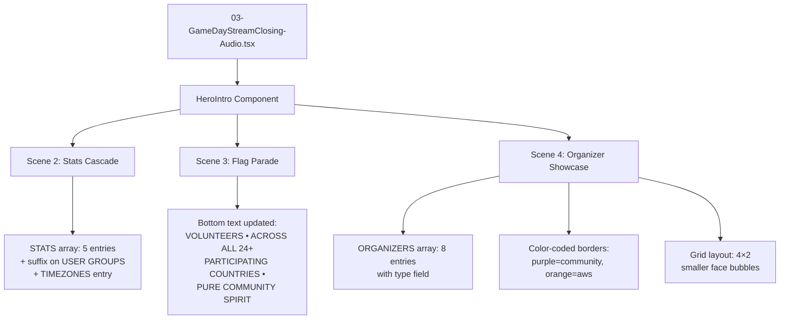

# Design Document: Closing Hero Updates

## Overview

This design covers 8 targeted changes to the HeroIntro component (frames 0–899) in `03-GameDayStreamClosing-Audio.tsx`. The changes fall into three categories:

1. **Stats corrections** (Req 1–3): Fix the user groups suffix, add a timezones stat, verify country count
2. **Messaging update** (Req 4): Replace "NOT EMPLOYED BY AWS" text with a pan-European community message
3. **Organizer showcase expansion** (Req 5–8): Expand from 2 to 8 organizers with color-coded type distinction and responsive layout

All changes are confined to the single composition file. No new components or files are created. The design system already exports all needed colors including `GD_ORANGE`.

## Architecture

The architecture remains unchanged — a single-file Remotion composition with inline data arrays and a `HeroIntro` component rendering 5 sequential scenes. The changes modify:

- **ORGANIZERS constant** (module-level): Expanded from 2 to 8 entries with a new `type` field
- **STATS constant** (inside HeroIntro): Modified suffix on entry 0, new 5th entry added
- **Scene 3 JSX**: Updated bottom text string
- **Scene 4 JSX**: New layout, color-coded borders, removal of separate Linda/host section
- **Import statement**: Add `GD_ORANGE` to the existing design system import



## Components and Interfaces

### Import Changes

Add `GD_ORANGE` to the existing import from `./shared/GameDayDesignSystem`:

```typescript
import {
  BackgroundLayer, HexGridOverlay, AudioBadge, GlassCard, springConfig, formatTime,
  GD_DARK, GD_GOLD, GD_PURPLE, GD_VIOLET, GD_PINK, GD_ACCENT, GD_ORANGE,
} from "./shared/GameDayDesignSystem";
```

### STATS Array (Scene 2)

The STATS array inside `HeroIntro` changes from 4 to 5 entries. The grid layout changes from `gridTemplateColumns: "1fr 1fr"` (2×2) to a layout that accommodates 5 stats. A reasonable approach: keep the 2-column grid but allow the 5th stat to span or center below, or switch to a flex-wrap layout with fixed-width items.

Design decision: Use a flex-wrap layout with centered items. Each stat occupies ~200px width, so 5 stats at 200px + gaps fit within 1280px in a single row or a 3+2 arrangement. A single centered row of 5 is cleanest at this resolution.

```typescript
// Layout change: from grid to flex-wrap centered
display: "flex",
flexWrap: "wrap",
justifyContent: "center",
gap: "40px 60px",
maxWidth: 1100,
```

The accent colors array expands to 5: `[GD_ACCENT, GD_VIOLET, GD_PINK, GD_GOLD, GD_ORANGE]`.

### ORGANIZERS Array (Module-level)

Expanded from 2 to 8 entries. Each entry gains a `type: "community" | "aws"` field. The type determines border color in Scene 4. Currently all 8 organizers are community type; the aws type is preserved for future use.

### Scene 3 Bottom Text

Simple string replacement:
- Before: `VOLUNTEERS • NOT EMPLOYED BY AWS • PURE COMMUNITY SPIRIT`
- After: `VOLUNTEERS • ACROSS ALL 24+ PARTICIPATING COUNTRIES • PURE COMMUNITY SPIRIT`

The "24+" is hardcoded as a string since it matches `COUNTRIES.length` which is already dynamically computed elsewhere. Alternatively, it could use template literal with `${COUNTRIES.length}+` for consistency.

Design decision: Use template literal `${COUNTRIES.length}+` so the text stays in sync with the data.

### Scene 4 Layout

Current: 2 organizers at 140×140px with `gap: 60` in a flex row, plus a separate Linda host section at the bottom.

New: 8 organizers in a 4×2 grid. Linda is now part of the ORGANIZERS array (no separate host section). Face bubble size reduces to ~90×90px to fit 8 faces with names/roles.

Layout:
```
[  org1  ] [  org2  ] [  org3  ] [  org4  ]
[  org5  ] [  org6  ] [  org7  ] [  org8  ]
```

```typescript
// Grid layout for 8 organizers
display: "grid",
gridTemplateColumns: "repeat(4, 1fr)",
gap: "24px 32px",
maxWidth: 1000,
```

Face bubble sizing:
- Width/height: 90px (down from 140px)
- Border: `3px solid` (unchanged thickness)
- Name font: 16px (down from 24px)
- Role font: 11px (down from 12px)
- City font: 10px (down from 11px)

### Color-Coded Borders

Border and glow color is determined by `organizer.type`:

```typescript
const borderColor = org.type === "community" ? GD_PURPLE : GD_ORANGE;
const glowColor = org.type === "community" ? GD_VIOLET : GD_ORANGE;
```

Applied as:
```typescript
border: `3px solid ${borderColor}`,
boxShadow: `0 0 20px ${glowColor}40, 0 4px 16px rgba(0,0,0,0.4)`,
```

## Data Models

### OrganizerEntry (updated)

```typescript
interface OrganizerEntry {
  name: string;       // Display name
  role: string;       // User group or AWS role
  city: string;       // City name
  flag: string;       // Country flag emoji
  face: string;       // Path relative to public/ (e.g., "AWSCommunityGameDayEurope/faces/jerome.jpg")
  type: "community" | "aws";  // NEW: determines border color
}
```

### ORGANIZERS Array (full)

```typescript
const ORGANIZERS: OrganizerEntry[] = [
  { name: "Jerome", role: "AWS User Group Belgium", city: "Brussels", flag: "🇧🇪", face: "AWSCommunityGameDayEurope/faces/jerome.jpg", type: "community" },
  { name: "Anda", role: "AWS User Group Geneva", city: "Geneva", flag: "🇨🇭", face: "AWSCommunityGameDayEurope/faces/anda.jpg", type: "community" },
  { name: "Andreas", role: "TBD", city: "TBD", flag: "🏳️", face: "AWSCommunityGameDayEurope/faces/andreas.jpg", type: "community" },
  { name: "Linda", role: "TBD", city: "TBD", flag: "🏳️", face: "AWSCommunityGameDayEurope/faces/linda.jpg", type: "community" },
  { name: "Lucian", role: "TBD", city: "TBD", flag: "🏳️", face: "AWSCommunityGameDayEurope/faces/lucian.jpg", type: "community" },
  { name: "Manuel", role: "TBD", city: "TBD", flag: "🏳️", face: "AWSCommunityGameDayEurope/faces/manuel.jpg", type: "community" },
  { name: "Marcel", role: "TBD", city: "TBD", flag: "🏳️", face: "AWSCommunityGameDayEurope/faces/marcel.jpg", type: "community" },
  { name: "Mihaly", role: "TBD", city: "TBD", flag: "🏳️", face: "AWSCommunityGameDayEurope/faces/mihaly.jpg", type: "community" },
];
```

Note: `role`, `city`, and `flag` for new organizers are placeholder values ("TBD" / "🏳️") per Requirement 5.4, designed to be updated later without structural changes.

### StatEntry (unchanged interface, new data)

```typescript
interface StatEntry {
  value: number;
  label: string;
  suffix: string;
  delay: number;
}
```

Updated STATS array:

```typescript
const STATS: StatEntry[] = [
  { value: 53, label: "USER GROUPS", suffix: "+", delay: 190 },       // Req 1: suffix changed "" → "+"
  { value: COUNTRIES.length, label: "COUNTRIES", suffix: "+", delay: 210 },  // Req 3: unchanged, verified
  { value: 2, label: "HOURS OF GAMEPLAY", suffix: "", delay: 230 },
  { value: 1, label: "EPIC DAY", suffix: "", delay: 250 },
  { value: 4, label: "TIMEZONES", suffix: "+", delay: 270 },          // Req 2: new entry
];
```


## Correctness Properties

*A property is a characteristic or behavior that should hold true across all valid executions of a system — essentially, a formal statement about what the system should do. Properties serve as the bridge between human-readable specifications and machine-verifiable correctness guarantees.*

### Property 1: Stat delay stagger consistency

*For any* pair of adjacent stats in the STATS array, the `delay` of the later stat should equal the `delay` of the earlier stat plus a constant stagger interval (20 frames).

**Validates: Requirements 2.3**

### Property 2: Country count matches unique flags

*For any* USER_GROUPS dataset, `COUNTRIES.length` should equal the number of unique `flag` values in USER_GROUPS, and the STATS entry for "COUNTRIES" should use this dynamic value.

**Validates: Requirements 3.1, 3.3**

### Property 3: Organizer data integrity

*For any* entry in the ORGANIZERS array, it must have all required fields (`name`, `role`, `city`, `flag`, `face`, `type`), the `type` must be either `"community"` or `"aws"`, and the `face` path must equal `"AWSCommunityGameDayEurope/faces/" + name.toLowerCase() + ".jpg"`.

**Validates: Requirements 5.2, 5.3**

### Property 4: Border color determined by organizer type

*For any* organizer entry, if `type` is `"community"` then the computed border color must be `GD_PURPLE` (`#7c3aed`) and the glow color must be `GD_VIOLET` (`#8b5cf6`); if `type` is `"aws"` then both border and glow color must be `GD_ORANGE` (`#f97316`).

**Validates: Requirements 6.1, 6.2**

### Property 5: Scene 4 layout fits viewport

*For any* set of N organizers arranged in a `repeat(4, 1fr)` grid with 90×90px face bubbles, 24px row gap, and 32px column gap, the total height of the grid (rows × (90 + name/role text height + 24px gap)) plus the top offset must not exceed 720px, and the total width must not exceed 1280px.

**Validates: Requirements 8.1**

## Error Handling

These changes are purely presentational data and layout modifications within a Remotion composition. Error scenarios are minimal:

- **Missing face images**: If a face image file is missing, Remotion's `` will fail to render. Mitigation: all 8 face images are confirmed to exist in `public/AWSCommunityGameDayEurope/faces/`.
- **Invalid organizer type**: If an organizer has a `type` value other than `"community"` or `"aws"`, the border color logic would fall through. Mitigation: TypeScript union type `"community" | "aws"` enforces valid values at compile time.
- **STATS overflow**: With 5 stats in a flex layout, if stat labels are too long they could wrap. Mitigation: all labels are short uppercase strings that fit within 200px at 13px font size.
- **COUNTRIES.length changes**: If USER_GROUPS data changes, the country count and Scene 3 text update automatically via the template literal. No manual sync needed.

## Testing Strategy

### Unit Tests (Example-Based)

Unit tests verify specific concrete values after the code changes:

1. **STATS array structure**: Verify the array has 5 entries, the "USER GROUPS" entry has `suffix: "+"`, the "TIMEZONES" entry exists with `value: 4, suffix: "+"`, and the "COUNTRIES" entry uses `COUNTRIES.length`.
2. **Scene 3 text content**: Verify the bottom text does NOT contain "NOT EMPLOYED BY AWS", DOES contain "VOLUNTEERS", "PARTICIPATING COUNTRIES", and "PURE COMMUNITY SPIRIT".
3. **ORGANIZERS completeness**: Verify the array has 8 entries with names matching `["Jerome", "Anda", "Andreas", "Linda", "Lucian", "Manuel", "Marcel", "Mihaly"]`.
4. **GD_ORANGE import**: Verify `GD_ORANGE` resolves to `"#f97316"`.
5. **Face bubble size**: Verify the face bubble dimensions are less than 140px (the previous size for 2 organizers).
6. **Layout type**: Verify Scene 4 uses a grid or flex-wrap layout.

### Property-Based Tests

Property-based tests use a library like **fast-check** (for TypeScript) to verify universal properties across generated inputs. Each test runs a minimum of 100 iterations.

Each property test must be tagged with a comment referencing the design property:
- **Feature: closing-hero-updates, Property 1: Stat delay stagger consistency**
- **Feature: closing-hero-updates, Property 2: Country count matches unique flags**
- **Feature: closing-hero-updates, Property 3: Organizer data integrity**
- **Feature: closing-hero-updates, Property 4: Border color determined by organizer type**
- **Feature: closing-hero-updates, Property 5: Scene 4 layout fits viewport**

Each correctness property is implemented by a single property-based test. Property tests focus on universal invariants (e.g., "for all organizers, the face path follows the naming convention"), while unit tests handle specific examples and edge cases.

### Testing Library

- **Property-based testing**: `fast-check` (already available in the JS/TS ecosystem, integrates with Vitest/Jest)
- **Unit testing**: Vitest (consistent with Remotion project conventions)
- **Minimum iterations**: 100 per property test
