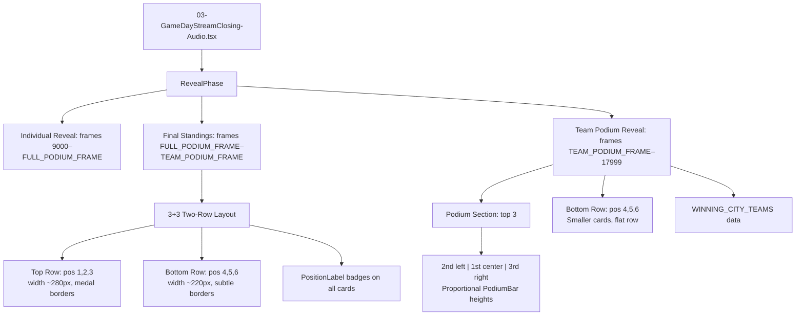

# Design Document: Closing Podium Redesign

## Overview

This design covers the redesign of the Final Standings slide and the addition of a new Team Podium Reveal slide in `03-GameDayStreamClosing-Audio.tsx`. Two major changes:

1. **Final Standings Redesign** (Req 1–3): Replace the current flat 5+1 `flexWrap` layout with a structured 3+3 two-row layout. Top row cards are larger with medal-colored borders and position labels. Bottom row cards are smaller. All cards get `#N` position badges.
2. **Team Podium Reveal** (Req 4–9): A new slide inserted after Final Standings showing the top 6 teams from the winning city (Vienna) in a podium-style layout — top 3 in a classic 2nd-1st-3rd podium arrangement with proportional bars, bottom 3 in a flat row below.
3. **Phase Timing** (Req 10): Adjust `FULL_PODIUM_FRAME` and add a `TEAM_PODIUM_FRAME` constant so both slides fit within the existing RevealPhase boundary (frames 9000–17999).

All changes are confined to the single composition file. No new files or shared components are created. The existing `TeamRevealCard`, `BackgroundLayer`, `HexGridOverlay`, design system colors, and `springConfig` are reused.

## Architecture

The architecture remains a single-file Remotion composition. The changes modify:

- **Module-level constants**: New `WINNING_CITY_TEAMS` array, new `TEAM_PODIUM_FRAME` constant, updated `FULL_PODIUM_FRAME` timing
- **RevealPhase component**: Rewritten `isFullPodium` branch for the 3+3 layout with position labels and visual hierarchy
- **New TeamPodiumReveal component**: Renders the podium slide with proportional bars for top 3 and a flat row for bottom 3
- **New PositionLabel component**: Small reusable badge for `#N` labels with optional medal emoji
- **TeamRevealCard**: Minor enhancement to accept an optional `positionLabel` overlay



### Phase Timeline (Revised)

```mermaid
gantt
    title RevealPhase Timeline (frames 9000–17999)
    dateFormat X
    axisFormat %s

    section Individual Reveals
    6th place (9000-9599)   :9000, 9600
    5th place (9600-10199)  :9600, 10200
    4th place (10200-10799) :10200, 10800
    3rd place (10800-11699) :10800, 11700
    2nd place (11700-12599) :11700, 12600
    1st place (12600-13499) :12600, 13500

    section Final Standings
    Full Podium (13500-14999) :13500, 15000

    section Team Podium
    Team Reveal (15000-17999) :15000, 18000
```



## Components and Interfaces

### New Constants

```typescript
// Frame where Team Podium Reveal begins (after Final Standings)
export const TEAM_PODIUM_FRAME = 15000;
```

`FULL_PODIUM_FRAME` stays at 13500. The Final Standings renders from frame 13500 to 14999 (1500 frames = 50 seconds). The Team Podium Reveal renders from frame 15000 to 17999 (3000 frames = 100 seconds, exceeding the 50-second minimum).

### PositionLabel Component

A small inline component rendering the rank badge:

```typescript
const PositionLabel: React.FC<{ rank: number }> = ({ rank }) => {
  const medal = rank === 1 ? "🥇" : rank === 2 ? "🥈" : rank === 3 ? "🥉" : null;
  const label = medal ? `${medal} #${rank}` : `#${rank}`;
  return (
    <div style={{
      position: "absolute", top: 8, left: 8, zIndex: 10,
      background: "rgba(0,0,0,0.6)", backdropFilter: "blur(8px)",
      borderRadius: 8, padding: "2px 8px",
      fontSize: 12, fontWeight: 700, color: "white",
      fontFamily: "'Inter', sans-serif",
    }}>
      {label}
    </div>
  );
};
```

### Revised Final Standings Layout (inside RevealPhase)

The `isFullPodium` branch is rewritten. Key layout decisions:

- **Top Row**: 3 cards at `width: 280px` with medal-colored borders (gold/silver/bronze) and gold glow on 1st place
- **Bottom Row**: 3 cards at `width: 220px` with subtle `rgba(255,255,255,0.1)` borders
- Both rows use `display: flex; justifyContent: center; gap: 20px`
- Each card wrapper is `position: relative` to allow the `PositionLabel` overlay
- Top row width is ~27% larger than bottom row (280 vs 220), satisfying the ≥20% requirement

```typescript
// Top row card widths
const TOP_CARD_WIDTH = 280;
// Bottom row card widths
const BOTTOM_CARD_WIDTH = 220;
// Ratio: 280/220 = 1.27 → 27% larger ✓
```

Border colors per rank (already in `TeamRevealCard`):
- Rank 1: `GD_GOLD` (#fbbf24) + gold glow shadow
- Rank 2: `#C0C0C0` (silver)
- Rank 3: `#CD7F32` (bronze)
- Ranks 4–6: `rgba(255,255,255,0.1)`

### TeamPodiumReveal Component

New component rendering the team-level podium:

```typescript
const TeamPodiumReveal: React.FC<{ frame: number }> = ({ frame }) => {
  const { fps } = useVideoConfig();
  const phaseFrame = frame - TEAM_PODIUM_FRAME;
  const entryProgress = spring({ frame: phaseFrame, fps, config: springConfig.entry });

  const top3 = WINNING_CITY_TEAMS.slice(0, 3);
  const bottom3 = WINNING_CITY_TEAMS.slice(3, 6);
  const maxScore = top3[0].score;
  const MAX_BAR_HEIGHT = 180;
  const MIN_BAR_RATIO = 0.4;

  // Podium order: [2nd, 1st, 3rd] for classic podium layout
  const podiumOrder = [top3[1], top3[0], top3[2]];
  const podiumRanks = [2, 1, 3];

  // ... renders podium bars + cards for top 3, flat row for bottom 3
};
```

**Podium Bar Height Calculation:**

```typescript
function getPodiumBarHeight(teamScore: number, maxScore: number, maxBarHeight: number): number {
  const ratio = teamScore / maxScore;
  const clampedRatio = Math.max(MIN_BAR_RATIO, ratio);
  return clampedRatio * maxBarHeight;
}
```

This ensures:
- 1st place gets `maxBarHeight` (180px)
- All bars are at least 40% of max (72px minimum)
- Heights are proportional to scores

**Podium Section Layout:**

```
┌─────────────────────────────────────────────┐
│              🏆 Team Podium                  │
│                                              │
│    ┌──────┐   ┌──────┐   ┌──────┐          │
│    │ Card │   │ Card │   │ Card │          │
│    │  #2  │   │  #1  │   │  #3  │          │
│    ├──────┤   ├──────┤   ├──────┤          │
│    │ Bar  │   │ Bar  │   │ Bar  │          │
│    │ med  │   │ tall │   │ short│          │
│    └──────┘   └──────┘   └──────┘          │
│                                              │
│    ┌──────┐ ┌──────┐ ┌──────┐              │
│    │  #4  │ │  #5  │ │  #6  │              │
│    └──────┘ └──────┘ └──────┘              │
└─────────────────────────────────────────────┘
```

### RevealPhase Routing Logic

The `RevealPhase` component gains a third branch:

```typescript
const RevealPhase: React.FC<{ frame: number }> = ({ frame }) => {
  const isTeamPodium = frame >= TEAM_PODIUM_FRAME;
  const isFullPodium = frame >= FULL_PODIUM_FRAME;

  if (isTeamPodium) {
    return <TeamPodiumReveal frame={frame} />;
  }
  if (isFullPodium) {
    // Revised 3+3 Final Standings layout
    // ...
  }
  // Existing individual reveal logic
  // ...
};
```

## Data Models

### Existing: TeamData Interface (unchanged)

```typescript
export interface TeamData {
  name: string;
  flag: string;
  city: string;
  score: number;
  logoUrl: string | null;
}
```

### New: WINNING_CITY_TEAMS

An array of 6 `TeamData` objects representing the top 6 teams from Vienna (the 1st-place user group's city), ordered by score descending:

```typescript
export const WINNING_CITY_TEAMS: TeamData[] = [
  { name: "Team Alpha",   flag: "🇦🇹", city: "Vienna Austria", score: 17320, logoUrl: LOGO_MAP["AWS User Group Vienna"] ?? null },
  { name: "Team Bravo",   flag: "🇦🇹", city: "Vienna Austria", score: 16890, logoUrl: LOGO_MAP["AWS User Group Vienna"] ?? null },
  { name: "Team Charlie",  flag: "🇦🇹", city: "Vienna Austria", score: 15740, logoUrl: LOGO_MAP["AWS User Group Vienna"] ?? null },
  { name: "Team Delta",   flag: "🇦🇹", city: "Vienna Austria", score: 14200, logoUrl: LOGO_MAP["AWS User Group Vienna"] ?? null },
  { name: "Team Echo",    flag: "🇦🇹", city: "Vienna Austria", score: 13650, logoUrl: LOGO_MAP["AWS User Group Vienna"] ?? null },
  { name: "Team Foxtrot", flag: "🇦🇹", city: "Vienna Austria", score: 12980, logoUrl: LOGO_MAP["AWS User Group Vienna"] ?? null },
];
```

Key constraints:
- All teams share the same city/flag (Vienna, Austria) since they're from the winning user group
- Scores are distinct and strictly descending (index 0 = highest)
- All use the Vienna user group logo (shared `logoUrl`)
- The `TeamData` interface is reused — no new interface needed

### Updated Constants Summary

| Constant | Current Value | New Value | Notes |
|---|---|---|---|
| `FULL_PODIUM_FRAME` | 13500 | 13500 | Unchanged |
| `TEAM_PODIUM_FRAME` | N/A | 15000 | New constant |
| `PHASE_BOUNDARIES.revealEnd` | 17999 | 17999 | Unchanged |

### Frame Budget Verification

| Slide | Start | End | Frames | Seconds |
|---|---|---|---|---|
| Individual Reveals | 9000 | 13499 | 4500 | 150s |
| Final Standings | 13500 | 14999 | 1500 | 50s |
| Team Podium Reveal | 15000 | 17999 | 3000 | 100s |
| **Total RevealPhase** | 9000 | 17999 | 9000 | 300s |

Both slides exceed the 1500-frame (50s) minimum. The combined duration fits within the existing RevealPhase boundary.

## Correctness Properties

*A property is a characteristic or behavior that should hold true across all valid executions of a system — essentially, a formal statement about what the system should do. Properties serve as the bridge between human-readable specifications and machine-verifiable correctness guarantees.*

### Property 1: Layout Width Hierarchy and Viewport Fit

*For any* valid `TOP_CARD_WIDTH` and `BOTTOM_CARD_WIDTH` values used in the Final Standings layout, `TOP_CARD_WIDTH` shall be at least 1.2× `BOTTOM_CARD_WIDTH`, and the total width of 3 cards plus gaps in either row shall not exceed 1280px.

**Validates: Requirements 1.4, 3.1**

### Property 2: Position Label Format

*For any* rank N in the range [1, 6], the `PositionLabel` component shall produce a string containing `#N`. For ranks 1, 2, and 3, the string shall additionally contain the corresponding medal emoji (🥇, 🥈, 🥉).

**Validates: Requirements 2.2, 2.3, 8.3**

### Property 3: WINNING_CITY_TEAMS Data Validity

*For any* element in the `WINNING_CITY_TEAMS` array: (a) the array has exactly 6 elements, (b) each element has `name` (string), `score` (number), `flag` (string), `city` (string), and `logoUrl` (string | null), (c) all scores are distinct, (d) scores are strictly descending by index, and (e) every element's `city` field contains "Vienna".

**Validates: Requirements 4.1, 4.2, 4.3, 4.4**

### Property 4: Podium Bar Height Correctness

*For any* positive `teamScore`, positive `maxScore` (where `teamScore ≤ maxScore`), and positive `maxBarHeight`, the function `getPodiumBarHeight(teamScore, maxScore, maxBarHeight)` shall return a value equal to `max(0.4, teamScore / maxScore) * maxBarHeight`. The result is always ≥ `0.4 * maxBarHeight` and ≤ `maxBarHeight`.

**Validates: Requirements 9.1, 9.2**

### Property 5: Podium Bar Ordering

*For any* 3 teams with distinct scores where `score[0] > score[1] > score[2]`, the computed podium bar heights shall satisfy `height[0] > height[1] > height[2]`.

**Validates: Requirements 6.2, 6.3, 6.4**

### Property 6: Card Content Completeness

*For any* `TeamData` object with all fields populated, the rendered team card output shall include the team name, city, numeric score, and position label. If `logoUrl` is non-null, the card shall render an image element with that URL. If `logoUrl` is null, the card shall render the flag emoji as fallback.

**Validates: Requirements 7.3, 8.1, 8.4**

### Property 7: Score Display Formatting

*For any* non-negative integer score, the displayed score string shall equal `score.toLocaleString()`, producing locale-appropriate thousand separators (e.g., 17320 → "17,320").

**Validates: Requirements 8.2**

### Property 8: Phase Timing Validity

*For any* valid configuration of `FULL_PODIUM_FRAME`, `TEAM_PODIUM_FRAME`, and `PHASE_BOUNDARIES.revealEnd`: (a) `TEAM_PODIUM_FRAME - FULL_PODIUM_FRAME ≥ 1500`, (b) `PHASE_BOUNDARIES.revealEnd - TEAM_PODIUM_FRAME + 1 ≥ 1500`, (c) `FULL_PODIUM_FRAME ≥ PHASE_BOUNDARIES.revealStart`, and (d) `TEAM_PODIUM_FRAME ≤ PHASE_BOUNDARIES.revealEnd`.

**Validates: Requirements 10.1, 10.2, 10.3**

## Error Handling

This feature operates on static, compile-time data arrays with no runtime user input or network calls. Error scenarios are minimal:

1. **Missing logo URL**: Already handled by the existing `TeamRevealCard` — when `logoUrl` is `null`, the flag emoji is rendered as fallback. The `WINNING_CITY_TEAMS` data uses the same `LOGO_MAP` lookup with `?? null` fallback.

2. **Invalid score values**: Not possible at runtime since `WINNING_CITY_TEAMS` is a hardcoded constant. The `getPodiumBarHeight` function clamps the ratio to a minimum of 0.4 to prevent visually invisible bars even if scores are very low relative to the max.

3. **Frame out of range**: The `RevealPhase` component already returns `null` if no current reveal is found. The new `isTeamPodium` check uses `frame >= TEAM_PODIUM_FRAME` which naturally handles the boundary. The spring animation gracefully handles negative elapsed frames (returns 0 progress).

4. **Division by zero in bar height**: If `maxScore` is 0 (impossible with valid data), the division would produce `Infinity`. Since data is static and validated by Property 3, this cannot occur. A defensive `Math.max(1, maxScore)` guard could be added but is not strictly necessary.

## Testing Strategy

### Property-Based Testing

Use **fast-check** as the property-based testing library (TypeScript/JavaScript ecosystem, works with Vitest/Jest).

Each property test must:
- Run a minimum of 100 iterations
- Reference the design property with a tag comment
- Use `fc.assert(fc.property(...))` pattern

Property tests to implement:

1. **Property 1 test**: Generate random card widths where top > bottom * 1.2, verify total row width ≤ 1280
   - Tag: `Feature: closing-podium-redesign, Property 1: Layout Width Hierarchy and Viewport Fit`

2. **Property 2 test**: Generate random ranks 1–6, verify PositionLabel output format
   - Tag: `Feature: closing-podium-redesign, Property 2: Position Label Format`

3. **Property 3 test**: Validate the static WINNING_CITY_TEAMS array against all structural constraints
   - Tag: `Feature: closing-podium-redesign, Property 3: WINNING_CITY_TEAMS Data Validity`

4. **Property 4 test**: Generate random (teamScore, maxScore, maxBarHeight) triples, verify formula and bounds
   - Tag: `Feature: closing-podium-redesign, Property 4: Podium Bar Height Correctness`

5. **Property 5 test**: Generate 3 distinct descending scores, compute bar heights, verify strict ordering
   - Tag: `Feature: closing-podium-redesign, Property 5: Podium Bar Ordering`

6. **Property 6 test**: Generate random TeamData objects, verify rendered output includes all required fields
   - Tag: `Feature: closing-podium-redesign, Property 6: Card Content Completeness`

7. **Property 7 test**: Generate random non-negative integers, verify toLocaleString formatting
   - Tag: `Feature: closing-podium-redesign, Property 7: Score Display Formatting`

8. **Property 8 test**: Generate random valid timing configurations, verify all timing constraints hold
   - Tag: `Feature: closing-podium-redesign, Property 8: Phase Timing Validity`

### Unit Tests

Unit tests complement property tests for specific examples and edge cases:

- **Medal emoji mapping**: Verify rank 1 → 🥇, rank 2 → 🥈, rank 3 → 🥉, rank 4 → no emoji
- **Border color mapping**: Verify rank 1 → GD_GOLD, rank 2 → #C0C0C0, rank 3 → #CD7F32, rank 4+ → rgba border
- **Podium order**: Verify the podium arrangement is [2nd, 1st, 3rd] (left, center, right)
- **Frame routing**: Verify `frame < FULL_PODIUM_FRAME` → individual reveal, `FULL_PODIUM_FRAME ≤ frame < TEAM_PODIUM_FRAME` → Final Standings, `frame ≥ TEAM_PODIUM_FRAME` → Team Podium
- **Gradient colors**: Verify podium bar gradient includes GD_ACCENT and GD_PURPLE
- **Specific timing values**: Verify FULL_PODIUM_FRAME = 13500, TEAM_PODIUM_FRAME = 15000

### Test Configuration

```typescript
// vitest.config.ts or jest equivalent
// Property tests use fast-check with numRuns: 100
import fc from "fast-check";

fc.assert(
  fc.property(/* arbitraries */, (/* values */) => {
    // property assertion
  }),
  { numRuns: 100 }
);
```

Tests should be placed in a test file alongside or near the composition file, e.g., `03-GameDayStreamClosing-Audio.test.ts`. Pure utility functions (`getPodiumBarHeight`, `PositionLabel` logic) should be exported for direct testing.
